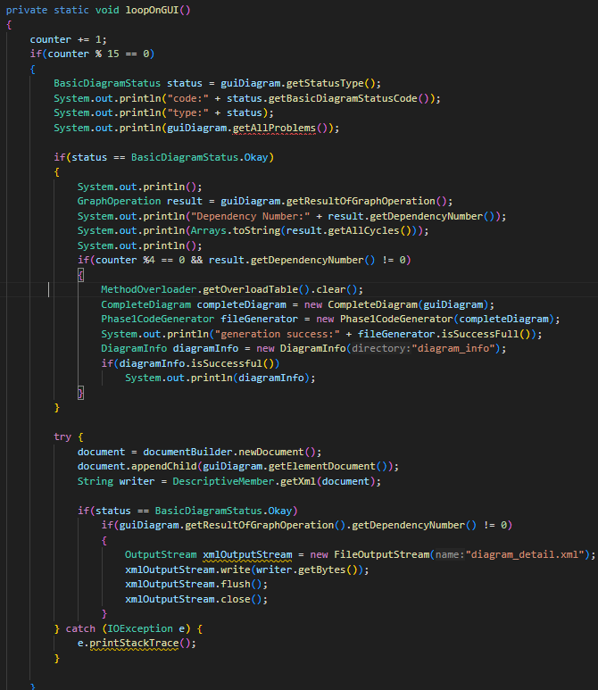
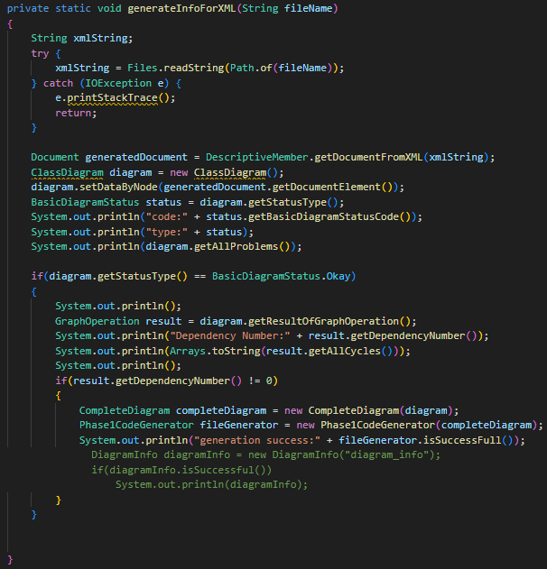
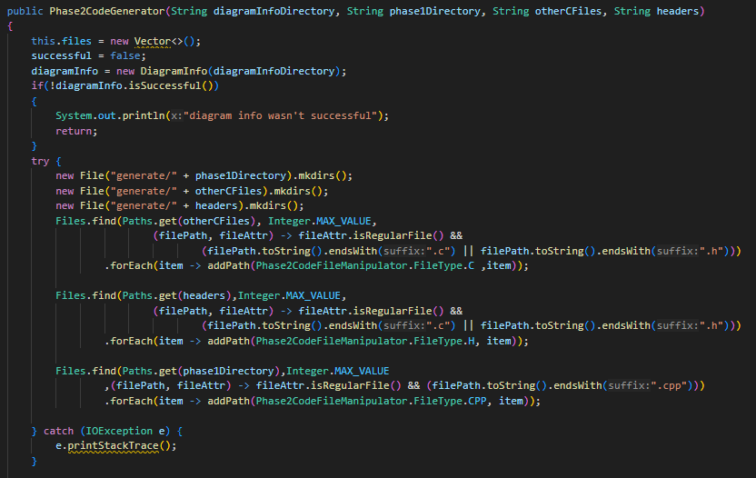
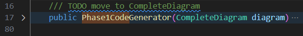
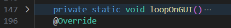
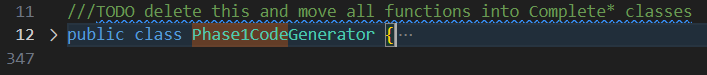

# Software-Engineering-Lab-Exp7

## بخش اول

### الگوی Facade 1

در نسخه قبلی پروژه، کلاس `Token` مستقیماً از کلاس‌های `Pattern` و `Matcher` مربوط به پکیج `java.util.regex` برای تشخیص نوع توکن (Token Type) استفاده می‌کرد. این کار باعث نقض اصل **تک‌وظیفه‌ای (Single Responsibility Principle)** می‌شد، چرا که کلاس `Token` همزمان هم مسئول نگهداری اطلاعات توکن بود و هم مسئول تشخیص نوع آن از روی رشته ورودی:

#### مشکل در کلاس `Token`:
- استفاده مستقیم از `Pattern` و `Matcher`.
- وجود منطق تشخیص نوع توکن (Type Resolution) در کلاس توکن، که باعث پیچیدگی و کاهش خوانایی می‌شد.
- سخت‌تر شدن تست و نگهداری کد.

#### راه‌حل:
برای رفع این مشکل، از الگوی طراحی **Facade** استفاده کردیم و کلاس جدیدی به نام `TokenTypeResolver` ایجاد نمودیم. این کلاس وظیفه دارد که با دریافت یک رشته، نوع توکن مناسب را بر اساس مقدار یا الگوی مشخص‌شده در `Type` بازگرداند:

#### نتیجه:

- کلاس `Token` اکنون ساده‌تر و قابل‌خواندن‌تر شده است.
- تشخیص نوع توکن به صورت مجزا در یک کلاس مستقل پیاده‌سازی شده است.
- نگهداری و توسعه کد در آینده آسان‌تر خواهد بود.

 
### الگوی Facade 2

#### مشکل اولیه

کلاس `Parser` به صورت مستقیم با کلاس‌های زیر درگیر بود:
- `lexicalAnalyzer` برای دریافت توکن‌ها
- `ParseTable` برای استخراج عملیات‌های نحو
- `ArrayList<Rule>` برای نگه‌داری قواعد گرامر
- `CodeGenerator` برای اجرای عملیات معنایی و تولید کد

این موضوع باعث شده بود که کلاس `Parser` دارای پیچیدگی زیادی باشد و از اصل تک‌وظیفگی (Single Responsibility Principle) پیروی نکند:

#### راه‌حل: استفاده از الگوی Facade

برای ساده‌سازی منطق کلاس `Parser` و جداسازی وظایف، یک کلاس جدید به نام `ParserServicesFacade` ایجاد شد که وظیفه‌ی مدیریت تمام سرویس‌های موردنیاز `Parser` را بر عهده دارد:

#### قابلیت‌های کلاس جدید `ParserServicesFacade`

این کلاس موارد زیر را در خود جای داده است:
- بارگذاری و مدیریت `Rules` از فایل
- بارگذاری و مدیریت `ParseTable`
- مدیریت `lexicalAnalyzer` و گرفتن توکن بعدی
- مدیریت کامل `CodeGenerator` شامل:
  - اجرای `semanticFunction`
  - نمایش خروجی حافظه با `printMemory()`

#### مزایای اعمال این تغییر

- کلاس `Parser` بسیار خواناتر و ساده‌تر شده است.
- همه‌ی منطق‌های کمکی و سرویس‌ها به صورت مجتمع در یک Facade قرار گرفته‌اند.
- تغییر در نحوه‌ی بارگذاری قواعد، جدول تحلیل، و تولید کد دیگر نیاز به تغییر در کلاس `Parser` ندارد.
- نگهداری و گسترش پروژه بسیار ساده‌تر خواهد شد.

### الگوی Parameterize Method
در این الگو چند متد که کارکرد مشابهی دارند ادغام می‌شوند و یک متد ساخته می‌شود که پارامتری اضافه ورودی میگیرد که مشخص کننده عملکرد مدنظر ما است. در کد داده شده سه تابع `add`، `sub` و `mult` کارکرد مشابهی دارند و عملا همه کد آن‌ها بجز یک خط مشترک است پس ما یک تابع تحت عنوان `arithmeticOperation` طراحی می‌کنیم که در ورودی `Operation` را گرفته و بر اساس آن رفتار می‌کند، سپس هر جایی از کد که یکی از این سه تابع را صدا زده باشد را نیز تغییر می‌دهیم.

### الگوی Remove Assignments to Parameters
در این الگو باید کاری بکنیم که پارامترهای یک متد درون آن تغییری نکنند. به این منظور از متغییرهای کمکی استفاده می‌کنیم و آنها را تغییر می‌دهیم. در کلاس `Rule` برای نمونه، در کد تابع `Rule` پارامتر متد `stringRule` تغییر کرده. برای اصلاح این موضوع همانطور که در کد زیر میبینیم، از یک متغییر کمکی تحت عنوان `resultStringRule` استفاده کردیم.

همچنین همین موضوع در متد `ParseTable` از کلاس `ParseTable` وجود داشت و به شکل زیر اینجا را نیز تغییر دادیم و از متغییر کمکی `resJsonTable` استفاده کردیم.

## بخش دوم

### سوال اول
**هر یک از مفاهیم زیر را در حد یک خط توضیح دهید:**

- **کد تمیز (Clean Code):**  
  کدی است که خوانا، ساده، قابل فهم و قابل نگهداری باشد و هدف آن را بتوان به راحتی از روی ساختارش متوجه شد.

- **بدهی فنی (Technical Debt):**  
  مشکلات و ساده‌سازی‌های موقتی در کد که برای رسیدن سریع‌تر به هدف ایجاد شده‌اند ولی در آینده باعث افزایش هزینه توسعه می‌شوند.

- **بوی بد کد (Code Smell):**  
  نشانه‌هایی در کد هستند که به طراحی ضعیف یا پیچیدگی غیرضروری اشاره دارند و ممکن است نیاز به بازسازی داشته باشند.

### سوال دوم
**طبق دسته بندی وبسایت [refactoring.guru](https://refactoring.guru/refactoring/smells) بوهای بد کد به پنج دسته تقسیم میشوند. در مورد هر کدام از این پنج دسته توضیح مختصری دهید.**

1. متورم‌ها (`Bloaters`)

    متورم‌ها به نوعی از بوی بد کد گفته می‌شود که در آن بخش‌هایی از برنامه مثل کلاس‌ها، متدها یا لیست پارامترها به شکلی بیش از حد بزرگ و پیچیده شده‌اند. این وضعیت معمولاً زمانی به‌وجود می‌آید که برنامه به‌مرور توسعه داده شده، اما طراحی اولیه بازنگری نشده است. با گذشت زمان، کلاس‌ها مسئولیت‌های زیادی را بر عهده می‌گیرند، متدها چندین کار را هم‌زمان انجام می‌دهند و توسعه‌دهندگان پارامترهای بیشتری به توابع اضافه می‌کنند تا نیازهای جدید را پوشش دهند. این مسئله خوانایی کد را کاهش داده، اشکال‌زدایی را دشوار می‌کند و مانع از تست‌پذیری مناسب می‌شود.

    برای مثال، یک کلاس که شامل ۲۰۰۰ خط کد است و کارهای مختلفی مانند مدیریت داده، ارتباط با پایگاه داده و کنترل واسط کاربر را هم‌زمان انجام می‌دهد، نمونه‌ای از یک کلاس متورم (`Large Class`) است. یا متدی که شامل ۱۰۰ خط کد است و چندین وظیفه را هم‌زمان انجام می‌دهد (مثلاً محاسبه قیمت، چاپ فاکتور و ارسال ایمیل) یک متد طولانی (`Long Method`) محسوب می‌شود. همچنین اگر متدی پارامترهایی مانند calculate(a, b, c, d, e, f) دریافت کند، می‌تواند نشانه‌ی یک لیست پارامتر طولانی (`Long Parameter List`) باشد.

2. سوءاستفاده‌کنندگان از شی‌گرایی (`Object-Orientation Abusers`)

    این دسته از بوی بد کدها مربوط به حالتی است که اصول شی‌گرایی به‌درستی استفاده نشده یا به شکلی ناقص یا نادرست پیاده‌سازی شده‌اند. در بسیاری از موارد، توسعه‌دهندگان مفاهیم کلیدی شی‌گرایی مانند وراثت، ترکیب و کپسوله‌سازی را اشتباه به‌کار می‌گیرند یا صرفاً از آن‌ها ظاهری استفاده می‌کنند بدون اینکه ساختار واقعی شی‌گرایانه را پیاده‌سازی کرده باشند.

    برای مثال، یک کلاس فقط شامل مجموعه‌ای از فیلدها است که هیچ منطق رفتاری ندارد و صرفاً داده‌ها را نگه می‌دارد؛ این نوع کلاس‌ها به عنوان Data Class شناخته می‌شوند. یا حالتی که یک کلاس فرزند، فقط به دلیل نیاز به توارث ایجاد شده، ولی هیچ‌کدام از متدهای کلاس والد را استفاده نمی‌کند و حتی برخی از آن‌ها را override کرده و تغییر داده، نمونه‌ای از `Refused Bequest` است. همچنین وقتی دو کلاس تقریباً عملکرد مشابهی دارند ولی رابط‌های متفاوتی دارند که با هم قابل ترکیب نیستند (`Alternative Classes with Different Interfaces`)، این نشانه‌ای از طراحی نادرست شی‌گرایانه است.

3. موانع تغییر (`Change Preventers`)

    موانع تغییر بوی بدهایی هستند که باعث می‌شوند حتی یک تغییر ساده در کد، منجر به تغییرات گسترده و خطرناک در قسمت‌های مختلف سیستم شود. این وضعیت معمولاً به دلیل طراحی ضعیف، وابستگی زیاد بین اجزای سیستم، یا تمرکز چندین مسئولیت در یک کلاس ایجاد می‌شود. وجود این نوع بوها، توانایی توسعه‌دهنده در اعمال تغییرات سریع، ایمن و با اعتماد بالا را از بین می‌برد.

    برای مثال، اگر بخواهید نام یک فیلد یا متد را تغییر دهید، اما مجبور شوید آن را در ۱۰ کلاس مختلف ویرایش کنید، با پدیده‌ای به نام `Shotgun Surgery` روبه‌رو هستید. یا زمانی که برای اضافه کردن یک ویژگی جدید باید فقط یک کلاس خاص را تغییر دهید، ولی چون آن کلاس چندین وظیفه مختلف دارد، مجبورید بخش‌های زیادی از آن را بازنویسی کنید، این حالت به نام `Divergent Change` شناخته می‌شود. همچنین اگر سلسله‌مراتب کلاس‌ها به‌گونه‌ای باشد که هر زمان یک کلاس جدید ایجاد می‌کنید، مجبور باشید کلاس‌های مربوط به UI، کنترل، پایگاه داده و ... را هم به همان ترتیب گسترش دهید، با `Parallel Inheritance Hierarchies` مواجه‌اید.

4. کدهای غیرضروری (`Dispensables`)

    کدهای غیرضروری آن بخش‌هایی از کد هستند که حذف آن‌ها نه‌تنها عملکرد برنامه را تحت تأثیر قرار نمی‌دهد، بلکه باعث خواناتر شدن، کاهش پیچیدگی و آسان‌تر شدن نگهداری کد خواهد شد. این کدها یا زمانی مفید بوده‌اند ولی اکنون بلااستفاده‌اند، یا از ابتدا صرفاً برای جبران ضعف طراحی نوشته شده‌اند.

    یکی از متداول‌ترین مثال‌ها، `Dead Code` است: متدهایی که هیچ‌گاه فراخوانی نمی‌شوند، شرط‌هایی که هرگز به واقعیت نمی‌پیوندند، یا متغیرهایی که هرگز استفاده نمی‌شوند. یا کامنت‌هایی که به‌جای واضح‌تر کردن کد، تلاش می‌کنند عملکرد پیچیده‌ی آن را توضیح دهند، در حالی که می‌شد با بهبود نام‌گذاری یا ساده‌سازی کد از کامنت بی‌نیاز شد. همچنین تکرار کد در چند بخش مختلف برنامه (`Duplicate Code`)، به‌جای استخراج آن به یک تابع مشترک، نیز نوعی از `Dispensible` محسوب می‌شود.

5. وابستگی‌های نامطلوب (`Couplers`)

    این نوع بوی بد زمانی رخ می‌دهد که اجزای مختلف نرم‌افزار به شکل ناسالمی به هم وابسته‌اند. در این حالت، کلاس‌ها یا ماژول‌ها اطلاعات زیادی درباره‌ی یکدیگر دارند، یا برای عملکرد صحیح، نیاز به تعامل مکرر و پیچیده دارند. این وابستگی‌ها مانع از انعطاف‌پذیری و قابلیت گسترش سیستم می‌شوند.

    برای نمونه، اگر یک کلاس دائم به داده‌های داخلی یک کلاس دیگر دسترسی دارد و از متدهای آن سوءاستفاده می‌کند، با پدیده‌ای به نام Feature Envy روبه‌رو هستید. یا اگر دو کلاس بیش از حد به هم نزدیک شده‌اند و پیوسته وضعیت یکدیگر را تغییر می‌دهند، به آن `Inappropriate Intimacy` گفته می‌شود. همچنین اگر در کدی زنجیره‌ای از متدهای دسترسی وجود داشته باشد مثل `obj.getA().getB().getC()،` این `Message Chain` می‌تواند نشانه‌ای از وابستگی بیش از حد و طراحی ضعیف باشد.

### سوال سوم
**یکی از انواع بوهای بد، Feature Envy است.این بوی بد در کدام یک از دسته‌بندی‌های پنج‌گانه قرار می‌گیرد؟**

بوی بد Feature Envy (یا «حسادت به ویژگی‌ها») در دسته‌بندی بوهای بد مربوط به شی‌گرایی قرار می‌گیرد. از میان دسته‌بندی‌های پنج‌گانه رایج در مهندسی نرم‌افزار (که معمولاً شامل دسته‌های زیر هستند):

بوهای بد سطح کلاس (Class-level smells)

بوهای بد سطح متد (Method-level smells)

بوهای بد معماری (Architectural smells)

بوهای بد مربوط به وابستگی (Dependency smells)

بوهای بد مربوط به مسئولیت‌ها و تقسیم وظایف (Responsibility smells)

بودی بد Feature Envy اغلب در دسته‌ی مسئولیت‌ها و تقسیم وظایف (و گاهی هم در متد-محور) جای می‌گیرد، زیرا مستقیماً به اصل "هر کلاس باید تنها مسئول وظایف خودش باشد" (SRP - Single Responsibility Principle) اشاره دارد.

در این بو، یک متد از یک کلاس، علاقه‌ی زیادی به داده‌ها یا متدهای کلاس دیگر نشان می‌دهد؛ یعنی به‌جای استفاده از داده‌ها و رفتارهای کلاس خودش، مدام به اعضای داخلی کلاس دیگر دسترسی دارد. این موضوع نشانه‌ای از وجود مسئولیت اشتباه یا وابستگی ناسالم بین کلاس‌ها است.

**برای برطرف کردن این بو، استفاده از کدام بازآرایی‌ها پیشنهاد می‌شود؟**

Move Method (جابجا کردن متد)

اگر یک متد در کلاس A، بیشتر از اینکه به داده‌های کلاس A وابسته باشد، به داده‌های کلاس B وابسته است، بهتر است آن متد را به کلاس B منتقل کرد.

این کار باعث می‌شود که کد cohesive تر شود (یعنی اعضای مرتبط با هم در کنار هم قرار گیرند).

Extract Method (استخراج متد)

اگر تنها بخشی از متد به داده‌های کلاس دیگر وابسته است، می‌توان آن قسمت را در قالب یک متد جدید در کلاس مقصد تعریف کرد و از کلاس اولیه فقط فراخوانی انجام داد.

Inline Method

در برخی موارد، اگر متد فقط یک یا دو خط کد است و استفاده از آن در کلاس دیگر ساده است، می‌توان آن را به‌صورت درون‌خطی (inline) در کلاس مقصد نوشت و متد اصلی را حذف کرد.

Move Field (جابجایی فیلد)

اگر دلیل استفاده زیاد از داده‌های یک کلاس، قرار گرفتن فیلد در مکان نادرست باشد، می‌توان فیلد مربوطه را هم جابجا کرد.

**در چه مواقعی باید این بو را نادیده گرفت؟**

اگرچه Feature Envy نشانه‌ای از طراحی ناسالم است، اما در برخی شرایط خاص می‌توان آن را نادیده گرفت یا تغییر نداد:

▪ وقتی که انتقال متد باعث افزایش پیچیدگی می‌شود:
اگر انتقال یک متد به کلاس دیگر باعث شود چندین وابستگی جدید به‌وجود بیاید یا ساختار پروژه پیچیده‌تر شود، ممکن است بهتر باشد که وضعیت فعلی حفظ شود.

▪ وقتی که متد به چندین کلاس وابسته است:
اگر یک متد به داده‌ها و متدهای چندین کلاس مختلف وابسته است، نمی‌توان آن را به‌طور واضح به یکی از آن‌ها منتقل کرد. در این صورت انتقال آن ممکن است باعث نقض اصل جداسازی شود.

▪ وقتی که تکرارپذیری، خوانایی، یا تست‌پذیری کاهش پیدا می‌کند:
در برخی موارد، ممکن است کدی که از چندین کلاس اطلاعات می‌گیرد، دقیقاً همان کاری را انجام دهد که از آن انتظار می‌رود. انتقال آن ممکن است فقط باعث سردرگمی توسعه‌دهنده‌ها یا دشوار شدن تست شود.

▪ در کدهای گذرا یا نمونه اولیه (Prototype):
در مراحل اولیه توسعه، ممکن است این نوع وابستگی‌ها موقتی باشند و بعداً با بازنگری‌های بزرگ‌تر حل شوند.

### سوال چهارم
**دو مورد از تفاوت های بین “Code Smell” و “Bug” را بنویسید**

1. **تأثیر بر عملکرد برنامه:**  
   - *Bug* (اشکال) معمولاً باعث می‌شود برنامه به صورت نادرست اجرا شود یا نتایجی اشتباه ارائه دهد. به عبارت دیگر، یک Bug باعث اختلال در عملکرد واقعی سیستم می‌شود و ممکن است باعث کرش، خطای محاسباتی یا رفتار غیرمنتظره شود.  
   - در مقابل، *Code Smell* (بوی بد کد) مستقیماً منجر به بروز خطا یا مشکل در اجرای برنامه نمی‌شود، اما نشانه‌ای از طراحی ضعیف یا پیچیدگی غیرضروری در کد است که در بلندمدت می‌تواند نگهداری و توسعه سیستم را دشوار کند.

2. **نحوه شناسایی:**  
   - *Bug* معمولاً از طریق اجرای تست‌ها، استفاده کاربر، یا ابزارهای تحلیل خطا شناسایی می‌شود. یافتن Bug نیاز به بررسی نتایج برنامه و رفتار واقعی آن دارد.  
   - اما *Code Smell* با تحلیل ایستای کد (بدون اجرا) یا بازبینی کد توسط توسعه‌دهندگان قابل شناسایی است. این مشکلات بیشتر در سطح طراحی و ساختار کد دیده می‌شوند، مانند تکرار بی‌رویه، توابع بسیار بزرگ یا وابستگی زیاد بین کلاس‌ها.

### سوال پنجم
**در وبسایت 29 بوی بد کد نامبرده شده است. سعی کنید 10بوی بد را در پروژه تبدیل کننده مدل به سی پیدا کنید و به آن اشاره کنید.**

1. **Feature Envy**

در کلاس `Main`، متد `loopOnGUI` دچار بوی بد `Feature Envy` است، زیرا بیشتر به داده‌ها و متدهای کلاس `GUIDiagram` وابسته است تا به اعضای کلاس خود.

2. **Duplicate Code**

در کلاس `Main`، منطق مربوط به بررسی و نمایش وضعیت `BasicDiagramStatus` و پردازش نتایج `GraphOperation` در دو متد `generateInfoForXML` و `loopOnGUI` به‌صورت تکراری پیاده‌سازی شده است. این تکرار کد (که نوعی بوی بد کد از نوع Duplicate Code محسوب می‌شود) باعث افزایش پیچیدگی، دشواری در نگهداری و احتمال بروز خطا در صورت نیاز به تغییرات آتی می‌شود. به عنوان نمونه، در هر دو متد، کدهایی برای استخراج وضعیت دیاگرام، چاپ کد وضعیت، بررسی تعداد وابستگی‌ها، نمایش چرخه‌ها و تولید کد وجود دارد که ساختار و منطق مشابهی دارند. برای رفع این مشکل و بهبود خوانایی و قابلیت نگهداری کد، پیشنهاد می‌شود این منطق‌های تکراری در قالب متدهای مستقل استخراج شوند و در هر دو متد فراخوانی شوند. این کار ضمن کاهش افزونگی، امکان اعمال تغییرات آینده را ساده‌تر و امن‌تر خواهد کرد.

همچنین در سازنده کلاس `Phase2CodeGenerator`، منطق جست‌وجو و افزودن فایل‌ها از دایرکتوری‌های مختلف چندین بار با ساختاری تقریباً یکسان تکرار شده است. تنها تفاوت در نوع فایل‌ها (.c, .h, .cpp) و نوع فایل ارسالی به متد `addPath` است. این تکرار کد نشان‌دهنده‌ی بوی بد `Duplicated Code` است که باعث کاهش خوانایی و افزایش هزینه‌ی نگهداری کد می‌شود. با انتقال این منطق به یک متد عمومی، می‌توان از تکرار جلوگیری کرد و کد را تمیزتر و قابل‌توسعه‌تر ساخت.

3. **Magic Numbers**

اعداد هاردکد شده در فایل `Main.java` بسیار زیاد دیده می‌شوند. در کد کلاس `Main` چند عدد جادویی وجود دارد که بدون توضیح یا نام مشخص مستقیماً در منطق برنامه استفاده شده‌اند و این موضوع باعث کاهش خوانایی و نگهداری‌پذیری کد می‌شود. مثلاً عدد ۱۵ در متد `loopOnGUI` برای شرط `counter % 15 == 0` استفاده شده که می‌توان آن را به یک ثابت معنادار مانند `GUI_UPDATE_INTERVAL` تبدیل کرد. همچنین عدد ۴ در همین متد برای شرط `counter % 4 == 0` به کار رفته که پیشنهاد می‌شود به صورت ثابتی مثل `CODE_GENERATION_INTERVAL` تعریف شود. عدد ۱۹۹۹ نیز در متد `run()` برای تأخیر در اجرای حلقه استفاده شده که بهتر است با نامی مانند `SLEEP_DURATION_MS` جایگزین شود تا مفهوم آن روشن‌تر باشد. علاوه بر این‌ها، مقادیر ۱۵۰۰ و ۷۵۰ که برای تعیین اندازه پنجره `GUI` به کار رفته‌اند نیز باید به صورت ثابت‌هایی مانند `WINDOW_WIDTH` و `WINDOW_HEIGHT` تعریف شوند. در نهایت، رشته‌هایی مانند `"diagram_info"، "phase1"، "c_files" و "headers"` نیز که به صورت مستقیم در منطق `main` استفاده شده‌اند، می‌توانند به صورت کانستنت تعریف شوند تا هم خوانایی افزایش یابد و هم تغییر آن‌ها در آینده ساده‌تر باشد.

4. **Large Class and Long Method:**

در این پروژه برخی کلاس‌ها بسیار بزرگ هستند و مسئولیت‌های متعددی را بر عهده دارند، همچنین تعدادی از متدها نیز بیش از حد طولانی‌اند که باعث کاهش خوانایی، افزایش پیچیدگی و دشواری در نگهداری کد شده است. چند تصویر از تعداد خطوط بعضی از توابع و کلاس‌ها مشاهده می‌شود.

5. **Switch Statements:**
   
در فایل `LexicalAnalyzer.java` یک بلوک `switch-case` بسیار بلند وجود دارد که یکی از نشانه‌های **کد بدبو (Code Smell)** است.  
استفاده زیاد از `switch-case` به‌ویژه زمانی که تعداد حالات زیاد باشد، می‌تواند خوانایی کد را کاهش دهد، نگهداری آن را سخت‌تر کند و نشانه‌ای از نبود طراحی شی‌ء‌گرا باشد.  
در این حالت، می‌توان با استفاده از **الگوی طراحی Strategy یا Polymorphism** این بخش را ساده‌تر و قابل توسعه‌تر کرد.

6. **Data Class:**

کلاس `ClassNode` دارای بوی **Data Class** است.  
این کلاس عمدتاً شامل فیلدهای داده‌ای (مانند نام، لیست متغیرها، توابع و ...) است و متد خاص یا منطق پردازشی قابل توجهی را پیاده‌سازی نمی‌کند.  
چنین کلاس‌هایی معمولاً فقط برای نگهداری داده استفاده می‌شوند و رفتار یا مسئولیت مشخصی ندارند که این موضوع می‌تواند نشانه‌ای از طراحی ضعیف و نیاز به بازآرایی (Refactoring) باشد.

7. **Dispensables, Comments:**

بخشی از کد در کلاس `Phase2CodeFileManipulator.java` کامنت شده است که نشان‌دهنده‌ی بوی بد **Dispensables: Comments** است.  
کدهای کامنت‌شده معمولاً بدون دلیل در کد باقی می‌مانند و هیچ عملکردی ندارند. این بخش‌ها خوانایی کد را کاهش می‌دهند و می‌توانند توسعه‌دهندگان را سردرگم کنند.  
در صورت عدم نیاز به این کدها، بهتر است آن‌ها به طور کامل حذف شوند یا در صورت نیاز، در سیستم کنترل نسخه نگهداری شوند.

8. 

9.

10.

### سوال ششم
